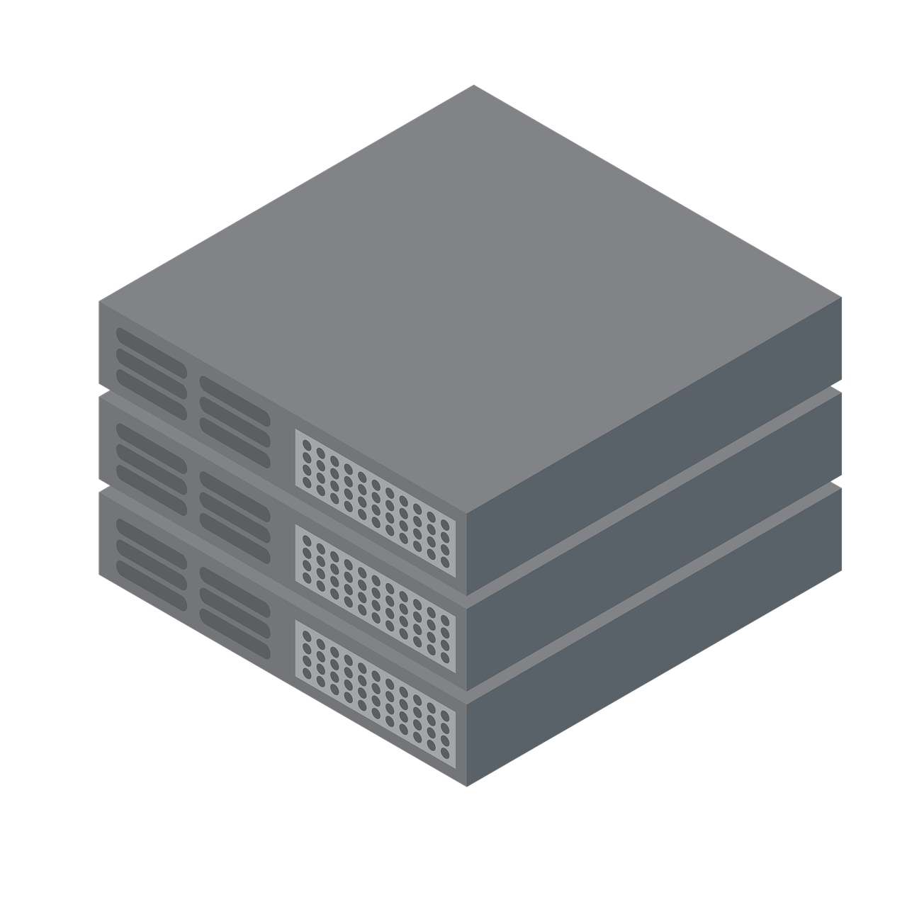

# Infra

<table align="center">
  <tr>
    <td align="center" colspan="2"> Baremetal</a></td>
    <td align="center" colspan="2"><a href="https://oraclecloud.com" target="_blank"> Oracle Cloud</a></td>
    <td align="center" colspan="2"><a href="https://cloud.google.com" target="_blank"> Google Cloud</a></a></td>
  </tr>
  <tr>
    <td align="center" colspan="3"><a href="https://kubernetes.io"> Kubernetes</a></td>
    <td align="center" colspan="3"><a href="https://docker.com"> Docker</a></td>
  </tr>
  <tr>
    <td align="center" colspan="2"><a href="https://www.talos.dev" target="_blank"> Talos Linux</a></td>
    <td align="center" colspan="2"><a href="http://ubuntu.com" target="_blank"> Ubuntu</a></td>
    <td align="center" colspan="2"><a href="https://cloud.google.com/container-optimized-os/docs" target="_blank"> Google COS</a></td>
  </tr>
  <tr>
    <td align="center"><a href="http://fluxcd.io" target="_blank"> FluxCD</a></td>
    <td align="center"><a href="http://prometheus.io" target="_blank"> Prometheus</a></td>
    <td align="center"><a href="http://opentofu.org" target="_blank"> OpenTofu</a></td>
    <td align="center"><a href="https://www.mend.io/renovate/" target="_blank"> Renovate</a></td>
    <td></td>
    <td align="center"><a href="https://supabase.com" target="_blank"> Supabase</a></td>
  </tr>
  <tr>
    <td align="center"><a href="http://perses.dev" target="_blank"> Perses</a></td>
    <td></td>
    <td align="center"><a href="http://opentelemetry.io" target="_blank"> OTel</a></td>
    <td align="center"><a href="https://tailscale.com" target="_blank"> Tailscale</a></td>
    <td align="center"><a href="https://cloud-init.io" target="_blank"> Cloud-Init</a></td>
    <td></td>
  </tr>
</table>

## Infrastructure as Code with GitOps using Flux, OpenTofu and Renovate

### Overview

This repository contains the infrastructure code for managing a Kubernetes cluster using GitOps principles. The deployment and configuration are orchestrated with Flux and automated updates are handled by Renovate.

### Automated Updates

Renovate is configured to automatically check for updates to dependencies. Refer to `renovate.json` for configuration details.

### License

This repository is licensed under the [The Unlicense](LICENSE). Feel free to modify and adapt it for your needs.

### Contribution

Feel free to contribute by opening issues or submitting pull requests. Your feedback and contributions are highly appreciated!
